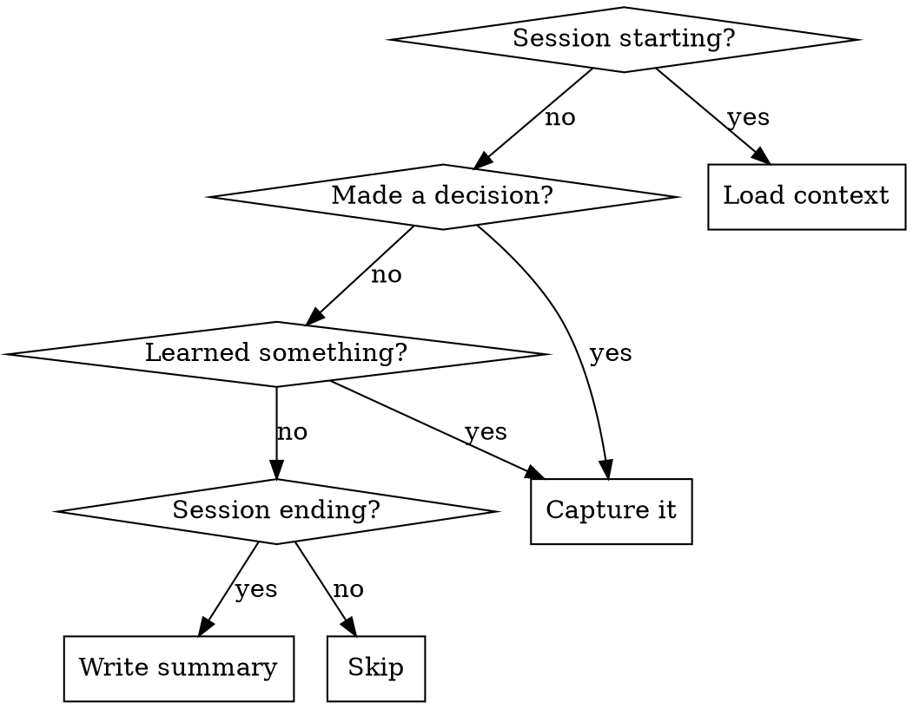

# OE-Brain Integration

## Overview

Persistent memory layer using MCP tools that captures decisions, learnings, tasks, and session context across conversations. Without this skill, these tools go unused and knowledge is lost between sessions.

## When to Use

## Triggers and Actions

### Session Start
Load prior context before doing anything else.

| Action | Tool | When |
|--------|------|------|
| Load branch history | `get_branch_context` | Always (auto-detects branch) |
| Load project overview | `get_project_context` | When switching projects or broad exploration |
| Check open tasks | `list_tasks` | Always |
| Search for related work | `search_context` | Before deep dives into unfamiliar areas |

### During Work
Capture knowledge as it happens — don't batch at the end.

| Action | Tool | When |
|--------|------|------|
| Record decision | `capture_decision` | Architectural choices, design tradeoffs, "why X over Y" |
| Record learning | `capture_learned` | Debugging insights, gotchas, techniques, patterns |
| Track task | `capture_task` | New TODOs that emerge during work |
| Complete task | `complete_task` | When a tracked task is finished |
| Update status | `capture_status` | Before long pauses or when context-switching |

### Session End
Summarize before the conversation ends.

| Action | Tool | When |
|--------|------|------|
| Write summary | `capture_session_summary` | Always — include what was done, decisions made, next steps |

### Standup / Status Check
| Action | Tool | When |
|--------|------|------|
| Get standup | `get_standup` | When user asks for standup or daily summary |
| Get PR context | `get_pr_context` | When reviewing or discussing a specific PR |

## Tag Conventions

For `capture_learned`, use these tags consistently:
- `technique` — reusable method or approach
- `gotcha` — surprising behavior, trap, or pitfall
- `pattern` — recurring code/design pattern
- `insight` — conceptual understanding
- `idea` — future possibility worth exploring

## What to Capture vs Skip

**Capture:**
- "We chose X because Y" (decision)
- "This broke because Z — the fix is W" (learned/gotcha)
- "Need to refactor Q before shipping" (task)
- Non-obvious debugging paths that took >5 minutes

**Skip:**
- Routine code changes with no surprising decisions
- Information already in CLAUDE.md or project docs
- Temporary debugging state (use `capture_status` instead)

## Stale Task Cleanup

At session start, after listing tasks, review for staleness:

1. **Ask the user** about any task that looks outdated or vague (no clear next action)
2. Tasks older than 2 weeks without activity should be flagged
3. Complete or remove tasks the user confirms are done/irrelevant
4. Personal tasks (non-work) are fine to keep — only flag if they seem forgotten

Do NOT silently delete tasks. Always confirm with the user.

## Self-Check: Am I Capturing Enough?

Ask yourself at these moments:

| Moment | Question | If yes → |
|--------|----------|----------|
| After debugging for >5 min | Did I learn something non-obvious? | `capture_learned` with `gotcha` or `technique` tag |
| After choosing between approaches | Did I make a tradeoff? | `capture_decision` with rationale |
| After completing a PR or feature | What would future-me need to know? | `capture_session_summary` |
| After the user says "bye"/"done"/"thanks" | Did I summarize this session? | `capture_session_summary` — do it NOW before responding |

**Hard rule:** Every session that involves code changes MUST end with a `capture_session_summary`. No exceptions.

## Common Mistakes

| Mistake | Fix |
|---------|-----|
| Forgetting to load context at session start | Check branch context FIRST, before any work |
| Batching all captures at session end | Capture decisions/learnings as they happen |
| Capturing too much noise | Only capture what future-you needs to know |
| Skipping session summary | Always summarize — it's the #1 value driver |
| Not including next_steps in summary | Future sessions need to know where to pick up |
| Auto-detection fails in subdirectories | Pass `branch`, `repo`, `project` explicitly when cwd isn't the repo root (e.g., `planning_docs/`, monorepo subdirs) |
| Never cleaning up stale tasks | Review task list at session start, flag anything >2 weeks old |
